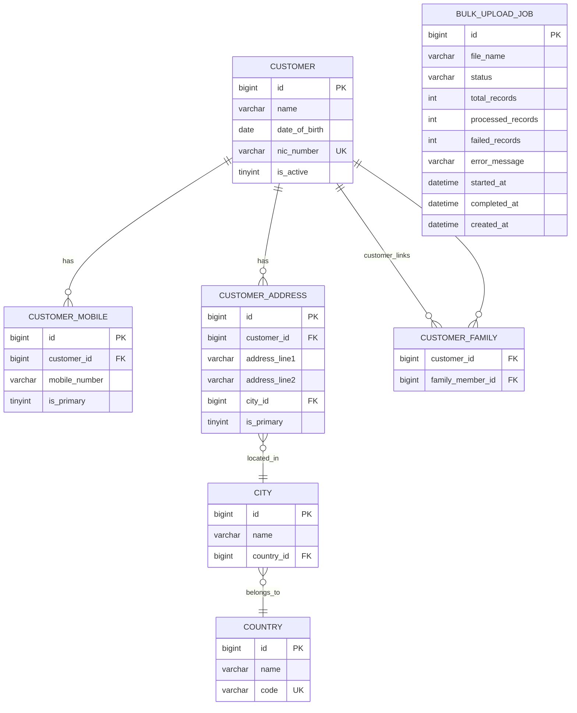

# Customer Management System

Small full-stack customer management application built to match the assignment requirements.

## Overview

- Java 8
- React JS
- MariaDB
- JUnit
- Axios
- Maven
- DDL, DML, and README included
- Customer create, update, view, list, and bulk Excel support

## Key Design Features

- Customer create, update, view, and list are implemented in the backend APIs and frontend screens.
- Mandatory fields are enforced for name, date of birth, and NIC.
- NIC uniqueness is enforced in both the service layer and the database.
- Multiple mobile numbers, addresses, and family-member links are supported.
- City and country are stored in master tables.
- The frontend does not expose separate city/country maintenance screens or raw master IDs.
- Customer detail loading uses fetch joins and batched access patterns to reduce unnecessary DB calls.
- Bulk import accepts Excel `.xlsx` files.
- Bulk import expects the mandatory columns `Name`, `DateOfBirth`, and `NIC`.
- Bulk import runs asynchronously, stages the file to disk, parses with Apache POI SAX, and saves in chunks for large-file handling.

## Technology Stack

| Layer | Technology |
|-------|-----------|
| Backend | Java 8, Spring Boot 2.7.18, Spring Data JPA |
| Frontend | React JS 19, Axios, React Router |
| Database | MariaDB 10.11 |
| Build | Maven |
| Testing | JUnit 5, Mockito, MockMvc, H2 |
| Mapping | MapStruct 1.5.5 |
| Excel Processing | Apache POI 5.2.5 |

All third-party libraries used in this project are free and stable, widely used community releases.

## Functional Scope

- Create customer
- Update customer
- View single customer
- View customers in a table
- Bulk customer create and update using Excel

Each customer includes:

- Name
- Date of birth
- NIC number
- Multiple mobile numbers
- Multiple family members who are also customers
- Multiple addresses with address line 1, address line 2, city, and country

## Non-Functional Notes

- City and country are stored in master tables. The frontend does not expose master-data maintenance screens or raw IDs.
- The user provides the address city. The backend resolves the linked city and country from master data.
- Customer detail loading uses fetch joins plus a separate family-member fetch to avoid N+1 issues.
- Bulk upload checks existing NIC values in batches to reduce duplicate-check queries.
- Bulk upload stages the Excel file to disk, parses it with Apache POI SAX, and saves records in chunks.
- Bulk upload runs asynchronously and returns a job ID immediately.

## Database Scripts

- `db/01_ddl.sql` creates the schema, constraints, and relationships
- `db/02_dml.sql` seeds master data and sample business data

These scripts cover the required database structure:

- `country` and `city` are separate master tables
- `city.country_id` links each city to its country
- `customer.nic_number` is unique
- `customer_mobile` stores multiple mobile numbers per customer
- `customer_address` stores multiple addresses per customer and links each address to a city
- `customer_family` stores family-member relationships between customers
- DML inserts sample countries, cities, customers, mobile numbers, addresses, and family links

## Database Schema



- `city` has a composite unique constraint on `(name, country_id)`.
- `customer_family` is a self-referencing join table between customers.

## Project Structure

- `backend/` - Spring Boot API
- `frontend/` - React application
- `db/01_ddl.sql` - schema script
- `db/02_dml.sql` - seed/master data script
- `docker-compose.yml` - MariaDB and Adminer

## Prerequisites

- JDK 8
- Maven 3.8+
- Node.js and npm
- MariaDB 10.11+ or Docker

## Run The Project

Start the database with Docker:

```bash
docker compose up -d
```

Or run the SQL scripts manually in order:

```bash
mysql -u root -p < db/01_ddl.sql
mysql -u root -p < db/02_dml.sql
```

Default database details:

- Database: `customer_mgmt`
- Username: `root`
- Password: `root`

Run the backend:

```bash
cd backend
mvn spring-boot:run
```

Run the frontend:

```bash
cd frontend
npm install
npm start
```

Application URLs:

- Backend API: `http://localhost:8080`
- Frontend: `http://localhost:3000`
- Adminer: `http://localhost:8082`

## Tests

Backend:

```bash
cd backend
mvn clean test
```

Frontend:

```bash
cd frontend
npm test -- --watchAll=false --runInBand
```

## API Endpoints

| Method | Endpoint | Description |
|--------|----------|-------------|
| GET | `/api/v1/customers` | Paginated customer list |
| GET | `/api/v1/customers/{id}` | View customer details |
| GET | `/api/v1/customers/search?q=` | Search customers by name or NIC |
| POST | `/api/v1/customers` | Create customer |
| PUT | `/api/v1/customers/{id}` | Update customer |
| DELETE | `/api/v1/customers/{id}` | Soft delete customer |
| POST | `/api/v1/bulk/upload` | Upload Excel file |
| GET | `/api/v1/bulk/jobs/{jobId}` | Check bulk upload progress |

## Bulk Upload

- Accepted format: `.xlsx`
- Required Excel columns: `Name | DateOfBirth (yyyy-MM-dd) | NIC`
- First row is treated as the header row
- Existing NIC values are updated
- New NIC values are inserted
- Processing is asynchronous and returns a job ID immediately

## Notes
